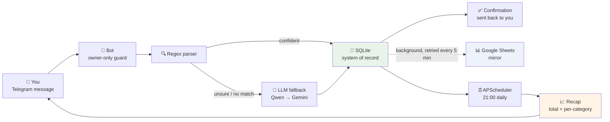

# 💸 Amna Finance — Telegram Daily Expense Agent

A personal Telegram bot that logs expenses from natural-language messages
("grab 45k, kopi 20k"), keeps SQLite as the system of record, mirrors every row
to a Google Sheet, and sends a recap each evening.

One long-running Python process. Long-polling only — no public URL, no TLS, no
inbound ports.

See [the P0–P5 PRD](docs/plan/done/2026-09-08-amna-daily-expenses-PRD.md) and
the [P6–P7 PRD](docs/plan/2026-09-08-amna-corrections-and-operations-PRD.md)
for the full design rationale. This repository currently implements
phases **P0–P5**.

## 🗺️ How a message flows



## 🚀 Quick start

```bash
python3.11 -m venv .venv
.venv/bin/pip install -r requirements.txt
cp .env.example .env      # fill in TELEGRAM_BOT_TOKEN and TELEGRAM_OWNER_ID
.venv/bin/python -m app.main
```

Only the two Telegram values are required. The Google Sheets mirror and the LLM
fallback parser are optional: leave their keys blank and the bot runs on SQLite
with regex-only parsing, logging a warning for each disabled layer.

## 💬 Usage

Send an expense; get a confirmation in under a second:

```
grab 45k, kopi hitam 20rb
→ ✅ Logged 2 items — Rp65.000
    • Transport        Rp45.000  grab
    • Food & Drink     Rp20.000  kopi hitam
```

| Command | Behaviour |
|---|---|
| `/today` | Today's recap: every item logged today, in order, with the day's total and delta vs 7-day average |
| `/week` | Monday-to-today, per-category |
| `/month` | 1st-to-today, per-category |
| `/sync` | Force a Sheets flush; report what's still pending |
| `/stats` | Row count, unsynced count, last sync, parser hit rates |

The bot ignores every user whose ID is not listed in `TELEGRAM_OWNER_ID`
(comma-separated for multiple owners, e.g. `TELEGRAM_OWNER_ID=111,222`). All
listed owners can log expenses and use commands, and all receive the daily
recap.

## 🧩 How parsing works

1. **Regex fast-path** — handles `45k`, `45rb`, `45 ribu`, `45.000`, `1.5jt`,
   `Rp45.000`, multi-item messages split on commas, newlines and `dan`. Free and
   sub-second, and it covers the large majority of real messages.
2. **LLM fallback** — only when regex finds nothing or is unsure. Primary is
   Qwen3 on OpenRouter's free tier, falling back to Gemini Flash Lite on any
   error, rate limit, timeout or unparseable response.
3. **Confidence gate** — below `CONFIDENCE_THRESHOLD` (default 0.7) the bot
   shows an inline Yes/No instead of writing silently. A bare number under 1000
   (`makan 45`) lands here: it almost certainly means 45.000, but "almost" isn't
   good enough for a financial record.

If both parsers fail, the raw message is never dropped.

## 🗄️ Data model

**SQLite is the system of record; Google Sheets is a mirror.** A local write is
instant and always succeeds; the Sheets append happens in the background and is
retried every 5 minutes until it lands. Each row carries a `uuid` written to
column A of the sheet, so a retry after an ambiguous failure cannot duplicate a
row.

Money is stored as an integer in minor units — `45000`, never `45000.0`.

Schema and migrations live in `app/storage/db.py`, versioned through a
`schema_version` table.

To browse or query the database directly with a GUI client (DBeaver, etc.),
including essential daily queries (today's spend, weekly/monthly breakdowns,
unsynced rows, low-confidence entries), see
[docs/database-access.md](docs/database-access.md).

## 📁 Layout

```
app/
  main.py            wire bot + scheduler, run the event loop
  config.py          pydantic-settings; decides which layers are enabled
  bot/               handlers (owner guard, logging, commands) + formatting
  parsing/           regex fast-path, LLM fallback, category taxonomy
  storage/           models, SQLite engine + migrations, Sheets client, repository
  jobs/              daily recap, Sheets sync/retry
tests/
```

`storage/repository.py` is the only module that touches SQL — everything else
goes through it.

## 📊 Google Sheets setup

1. Create a Google Cloud service account and download its JSON key.
2. `chmod 600` the key and keep it outside the repo.
3. Share the target sheet with the service account's email address (not
   "anyone with link").
4. Set `GOOGLE_SHEET_ID` and `GOOGLE_CREDENTIALS_PATH`.

The worksheet and its header row are created on first write.

## 🧪 Tests

```bash
.venv/bin/pytest
```

`tests/fixtures/messages.yaml` holds real-shaped Indonesian messages and the
entries the parser must produce; it's the highest-value suite in the project.
No test touches Telegram, Google, or an LLM.

## 🚧 Not yet built

`/undo`, `/edit`, `/cat` (PRD P6); the systemd unit, backups and log rotation
(P7); the Hermes Agent integration (P8). All three attach to
`storage/repository.py`.

## 📜 License

[GNU AGPL-3.0](LICENSE) — if you run a modified version of this bot as a
network service, you must also make that modified source available to its
users.
