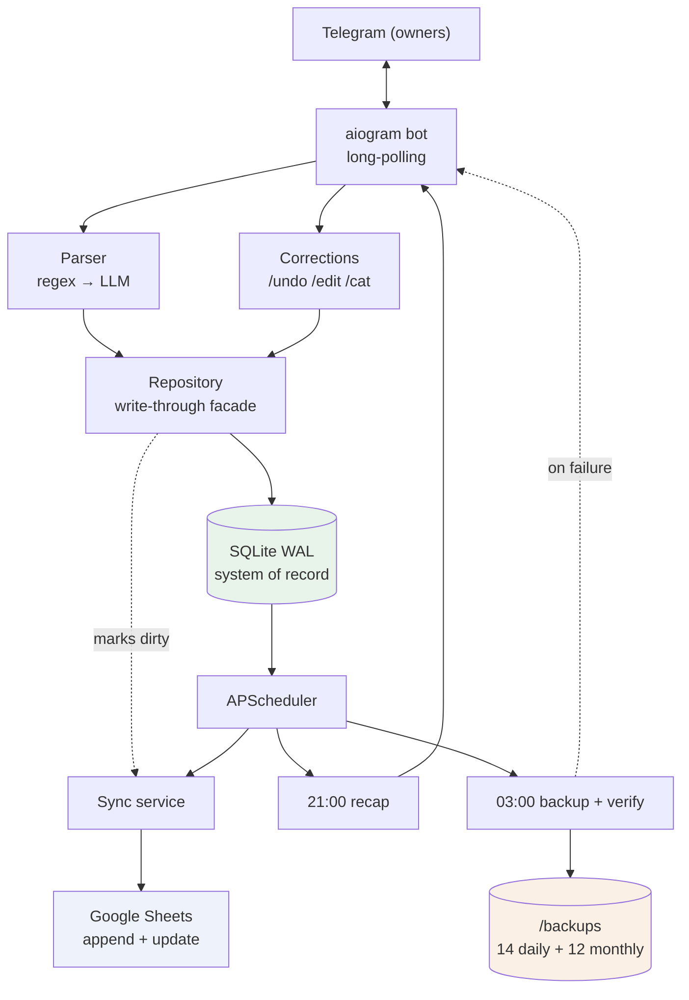
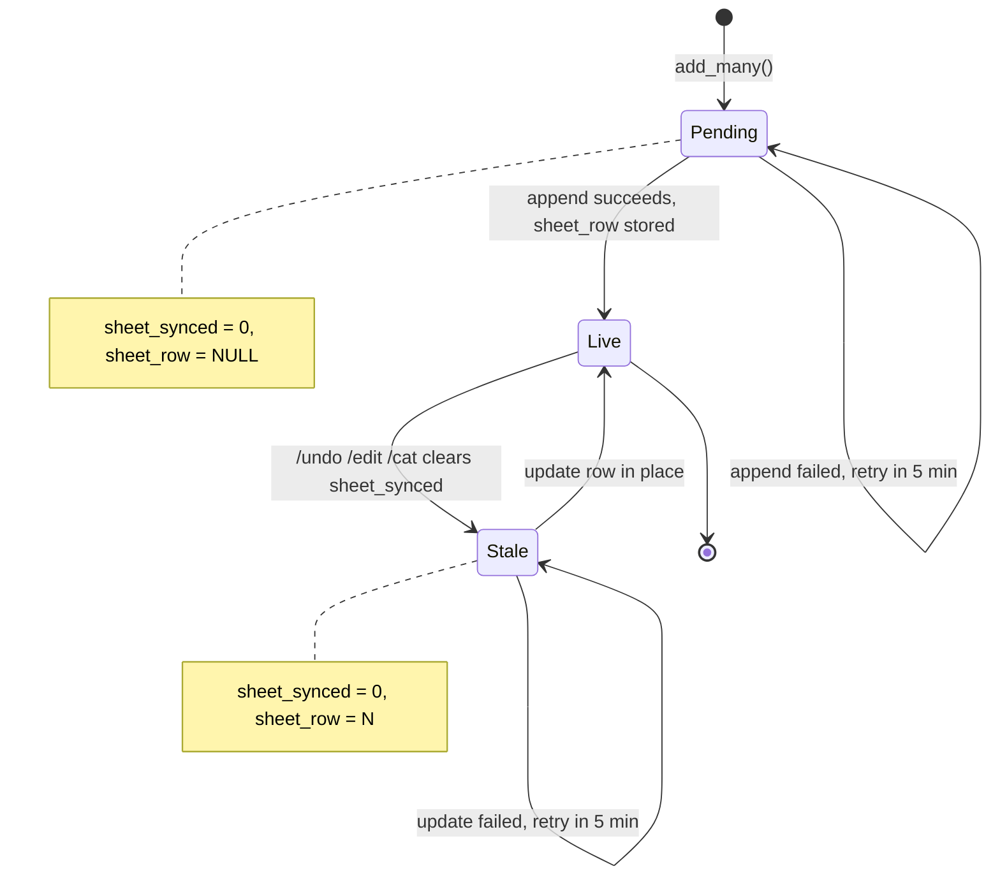
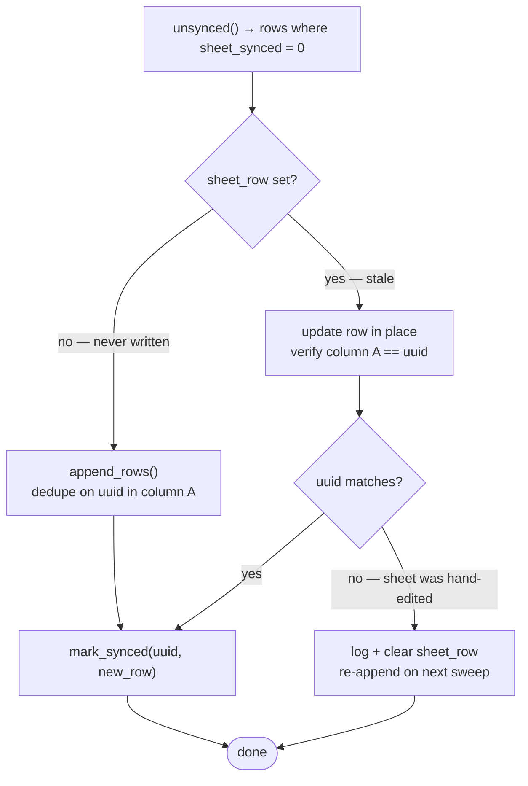
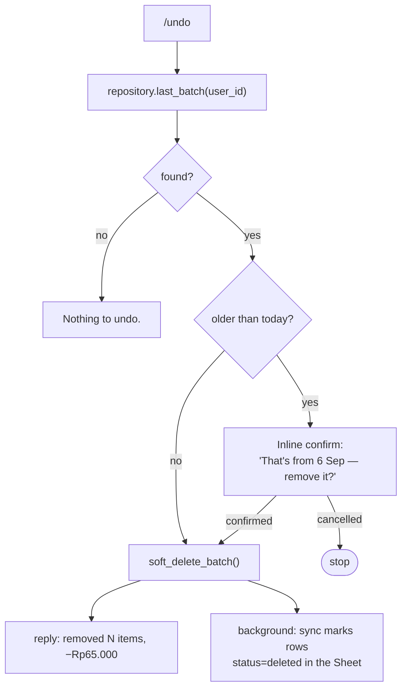
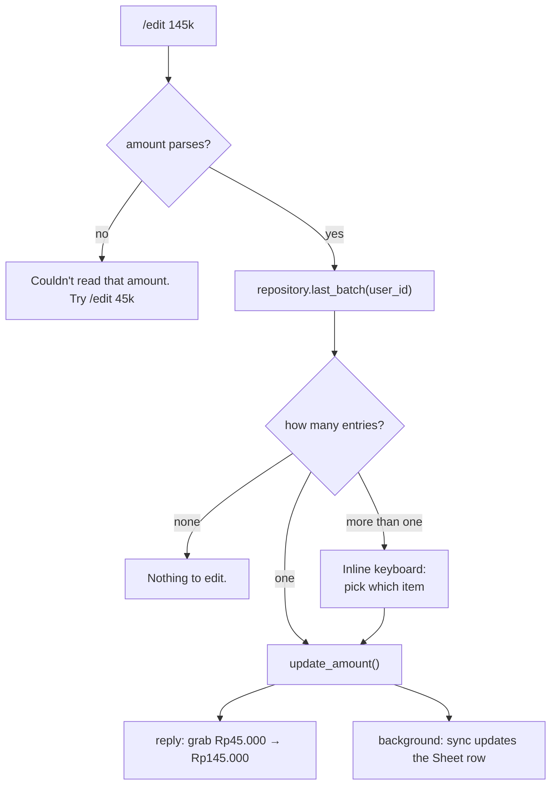
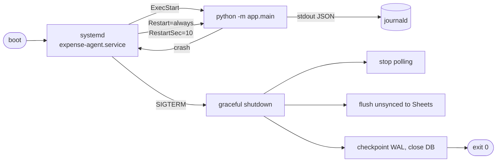
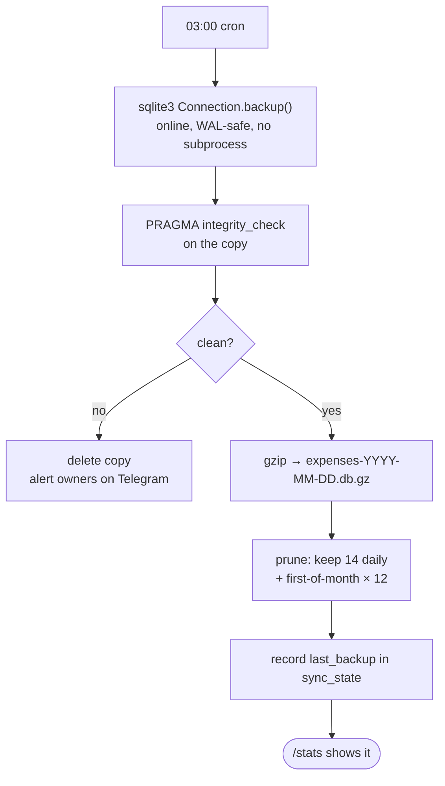

# PRD — Corrections & Operations (Phase 2)

**Status:** Draft v1.0
**Owner:** Personal project (single deployment, multiple owners)
**Target runtime:** Self-hosted on cloud VPS
**Predecessor:** [`done/2026-09-08-amna-daily-expenses-PRD.md`](done/2026-09-08-amna-daily-expenses-PRD.md) (P0–P5, shipped)
**Covers:** Build-plan phases **P6** (corrections) and **P7** (operations)
**Last updated:** 2026-09-08

---

## 1. Overview

Phase 1 delivered a bot that logs expenses reliably. It cannot yet *fix* them,
and it cannot yet be left alone on a VPS for a month without someone watching.

This phase closes both gaps:

- **P6 — Corrections.** `/undo`, `/edit`, `/cat`, so a bad parse is repaired
  from the compose box instead of by opening the Sheet.
- **P7 — Operations.** systemd, graceful shutdown, automated verified backups,
  and log retention, so the process survives reboots, crashes and disk growth
  unattended.

### Goals

- Repair any recent entry in one message, with the Google Sheet following
  automatically.
- Never let a correction produce a duplicate, an orphan, or a row whose Sheet
  copy disagrees with SQLite.
- Attribute every entry to the owner who logged it, now that multiple owners
  are supported.
- Survive `reboot`, `kill -9`, and a full disk without losing an expense.
- Restore the database from a backup in under five minutes, verified by drill.

### Non-goals (this phase)

- Hermes Agent integration (P8) — deferred to its own PRD.
- Budgets, alerts, receipt OCR, multi-currency, income/transfers — still
  Future Work.
- A correction *history* UI. Corrections are audited in the DB, not browsable
  from Telegram.
- Editing anything other than amount and category (notes and dates stay
  immutable in v1).

### Success criteria

| Metric | Target |
|---|---|
| Correction reaches the Sheet | 100% within one sync interval (5 min) |
| Sheet/DB divergence after corrections | 0 rows, verified by a reconciliation check |
| Duplicate rows created by any correction path | 0 |
| Unattended uptime | ≥ 30 days across at least one reboot |
| Backup restore drill | < 5 min, `integrity_check` clean |
| Correction latency (command → confirmation) | < 2s |

---

## 2. Where we are today

Shipped and committed (140 tests passing):

```
app/
  main.py            aiogram long-polling + APScheduler, one process
  config.py          pydantic-settings; multi-owner TELEGRAM_OWNER_ID
  bot/handlers.py    owner guard, log flow, /start /help /today /week /month /sync /stats
  bot/formatting.py  IDR formatting, confirmations, recap templates
  parsing/           regex fast-path -> Qwen (OpenRouter) -> Gemini fallback
  storage/           models, SQLite+WAL+migrations, append-only Sheets client, repository
  jobs/              daily recap (21:00), Sheets sync retry (*/5min)
```

Three concrete gaps block this phase:

| Gap | Consequence |
|---|---|
| `repository` has `soft_delete()` but no way to *find* the last entry, and no update methods | `/undo`, `/edit`, `/cat` have nothing to call |
| `sheets.py` is **append-only** — no update, no delete | A corrected row can never reach a Sheet row already written |
| `expenses` has **no `user_id`** and **no batch grouping** | With multiple owners, "undo my last entry" is not expressible; and a 3-item message has no identity to undo as a unit |

There is also no `deploy/` directory at all.

---

## 3. User stories

1. **Fat-fingered amount** — I sent `grab 45k` but it was 145k. I send
   `/edit 145k` and the entry, and the Sheet, are corrected.
2. **Wrong category** — `titip 15k` landed in Uncategorized. `/cat groceries`
   fixes it, and the recap re-buckets immediately.
3. **Accidental log** — I logged something twice. `/undo` removes the whole
   last message, all three items of it, not just the last row.
4. **Walk it back** — Two `/undo`s in a row remove the two most recent
   messages, oldest untouched.
5. **Not my entry** — My partner logs an expense; my `/undo` does not touch it.
6. **Reboot** — The VPS reboots at 04:00. The bot is back before I wake up and
   the 21:00 recap still arrives.
7. **Disk safety** — Backups run nightly, verify themselves, and tell me on
   Telegram if one ever fails.

---

## 4. Architecture changes

No new processes and no new dependencies. The additions are one new column
family in SQLite, a mutating Sheets client, and two new scheduled jobs.



New in this phase: the **Corrections** path, the **update** arrow into Sheets,
and the **backup** job.

---

## 5. Schema changes (migration 2)

`app/storage/db.py` already carries an ordered `MIGRATIONS` list gated by
`schema_version`. This phase appends **version 2**. It is additive only — no
column is dropped or retyped, so a rollback to the previous release keeps
working against the same file.

```sql
-- Who logged it. NULL means "logged before multi-owner support existed".
ALTER TABLE expenses ADD COLUMN user_id INTEGER;

-- Groups the rows produced by one message, so /undo works on the message.
ALTER TABLE expenses ADD COLUMN batch_id TEXT;

-- Last correction time. NULL means never edited.
ALTER TABLE expenses ADD COLUMN updated_at TEXT;

CREATE INDEX idx_expenses_batch ON expenses(batch_id);
CREATE INDEX idx_expenses_recent
    ON expenses(user_id, id DESC) WHERE deleted_at IS NULL;
```

**Backfill,** run inside the same migration:

```sql
-- Rows written together share created_at and raw_message: that was a batch.
UPDATE expenses
SET batch_id = (
    SELECT 'legacy-' || MIN(e2.id)
    FROM expenses e2
    WHERE e2.created_at = expenses.created_at
      AND e2.raw_message = expenses.raw_message
)
WHERE batch_id IS NULL;
```

`user_id` is deliberately left NULL for legacy rows. Ownership checks treat
NULL as "anyone may correct it" — see §7.1.

### Sheet layout change

The Sheet gains one column so a deleted entry can be represented **without
removing the row**:

| A: uuid | B: date | C: amount | D: currency | E: category | F: note | G: raw | H: parser | **I: status** |
|---|---|---|---|---|---|---|---|---|

`status` is `active` or `deleted`. On first write after the upgrade, if the
header row lacks `status`, the client appends the header cell and backfills
`active` down the existing rows.

> **Why not delete the Sheet row?** Deleting row *N* shifts every row below it
> up by one, silently invalidating every `sheet_row` value stored in SQLite.
> One delete would corrupt the mapping for the entire history. Rows are
> therefore never removed or reordered — only mutated in place. The `Summary`
> tab filters on `status = "active"`.

---

## 6. The sheet mutation model

This is the core design of the phase. Everything in §7 depends on it.

Today `sheet_synced` is a binary flag and the only transition is
*unsynced → synced*. A correction needs a third meaning: **synced, but the
Sheet copy is now stale**. Rather than add a column, we reuse the two fields
already present:

| `sheet_synced` | `sheet_row` | Meaning | Sync action |
|---|---|---|---|
| `0` | `NULL` | Never written to the Sheet | **APPEND**, store the new row number |
| `0` | *N* | Written, then corrected — stale | **UPDATE** row *N* in place |
| `1` | *N* | Sheet matches SQLite | none |

Every correction does exactly one thing to the mirror state: set
`sheet_synced = 0`. It leaves `sheet_row` alone. The sync job then dispatches
on whether `sheet_row` is set.



The retry job's dispatch becomes:



Two safety properties fall out of this:

- **No duplicates.** Appends still dedupe on the uuid in column A, exactly as
  they do today. Updates target a known row number and re-verify the uuid
  before writing.
- **Self-healing against manual edits.** If someone reorders or deletes rows in
  the Sheet by hand, the uuid check fails, `sheet_row` is cleared, and the row
  is re-appended at the bottom on the next sweep. The Sheet may then hold a
  stale orphan, which the reconciliation check in §8.3 reports.

### Sheets client additions (`app/storage/sheets.py`)

```python
async def update(self, expenses) -> dict[str, int]   # batched values_batch_update
async def ensure_status_column(self) -> None         # idempotent header migration
async def reconcile(self) -> ReconcileReport         # §8.3
```

`update` uses a single `values_batch_update` call for all dirty rows rather
than one call per row — a `/undo` of a 5-item message must cost one API call,
not five. `NullSheetsClient` grows matching no-ops so callers never branch.

---

## 7. P6 — Corrections

### 7.1 What "the last entry" means

Two rules, both enforced in `repository`:

1. **Ownership.** A correction only ever touches rows where
   `user_id = :me OR user_id IS NULL`. The NULL clause keeps pre-migration
   entries correctable in a single-owner deployment; in a multi-owner one, new
   entries always carry a `user_id`, so owners cannot reach each other's rows.
2. **Granularity.** `/undo` operates on the last **batch** (one message).
   `/edit` and `/cat` operate on a single **entry**.

New repository methods:

```python
def last_batch(self, user_id: int) -> list[Expense]        # newest undeleted batch
def last_entry(self, user_id: int) -> Expense | None       # newest undeleted row
def entries_in_batch(self, batch_id: str) -> list[Expense]
def soft_delete_batch(self, batch_id: str) -> list[Expense]
def update_amount(self, uuid: str, amount: int) -> Expense | None
def update_category(self, uuid: str, category: str) -> Expense | None
```

Every mutator sets `updated_at`, sets `sheet_synced = 0`, and leaves
`sheet_row` untouched. `add_many()` gains `user_id` and generates a shared
`batch_id`.

### 7.2 `/undo`



Repeated `/undo` walks backwards: each call finds the newest batch that is not
already soft-deleted. There is no `/redo` in this phase — a mistaken `/undo` is
re-entered as a fresh message.

### 7.3 `/edit <amount>`

Amount parsing **reuses the existing fast-path** rather than adding a second
number grammar. `app/parsing/regex_parser.py` gains one public helper extracted
from the internals it already has:

```python
def parse_amount(text: str) -> tuple[int, float] | None:   # (minor units, confidence)
```

so `/edit 50k`, `/edit 50rb`, `/edit 50.000` and `/edit 1.5jt` all work, and
`_parse_number` stays the single source of truth for money syntax.



### 7.4 `/cat <category>`

Identical shape to `/edit`, but the argument goes through the existing
`categories.normalize()`, so `/cat food`, `/cat Food & Drink` and
`/cat groceries` all snap onto the taxonomy. An unrecognised category is
rejected with the valid list rather than silently creating a new bucket.

The multi-entry picker is the same inline-keyboard component as `/edit`, and
reuses the `pending` token dict already in `handlers.py` for low-confidence
confirmations.

### 7.5 Command summary

| Command | Target | Effect |
|---|---|---|
| `/undo` | last batch | Soft-deletes every row in the message; Sheet rows become `status=deleted` |
| `/edit <amount>` | last entry | Corrects `amount`; picker if the batch has several items |
| `/cat <category>` | last entry | Corrects `category`, normalised to the taxonomy |
| `/last` | — | Shows what `/undo` and `/edit` would act on, without changing anything |

`/last` is new and cheap, and removes the guesswork before a destructive
command.

### 7.6 Edge cases

| Case | Behaviour |
|---|---|
| `/undo` with no entries at all | "Nothing to undo." — no error |
| `/undo` twice | Removes the two most recent batches |
| `/edit` on a batch of 3 | Inline picker; token expires with the process |
| `/edit` while the row is still unsynced | Amount changes; row is still `sheet_row IS NULL`, so it appends once, already correct |
| Correction while Sheets is down | Applied to SQLite immediately; the sweep reconciles later. User sees success. |
| Sheet row hand-deleted by a human | uuid check fails on update → `sheet_row` cleared → re-appended |
| Owner A `/undo` after owner B logs | A's own last batch is found; B's is untouched |
| `/cat` with an unknown category | Rejected, valid categories listed |

---

## 8. P7 — Operations

### 8.0 Runtime choice: systemd, not Docker or Kubernetes

Before specifying the supervision unit below, it's worth recording *why* this
phase supervises a bare venv with systemd rather than a container — the
question comes up naturally once operations are on the table, and the
reasoning is not obvious from the unit file alone.

**Kubernetes is out of scope, full stop.** The original PRD's design decisions
(predecessor §3) already reject a queue/broker as "pure overhead" at personal
scale — a Kubernetes control plane is the same tradeoff several multiples
larger. SQLite's WAL mode assumes a single writer on local disk; a pod
rescheduled to a different node loses that disk unless a `ReadWriteOnce`
PersistentVolume is bolted on, which just reconstructs "one VPS with a disk"
through far more machinery. There is nothing here to scale, roll out, or
coordinate across services.

**Docker vs. systemd is a closer call**, decided as follows:

| Factor | systemd | Docker | Why it matters here |
|---|---|---|---|
| Auto-restart, crash-loop protection | Native (`Restart=always`, `StartLimitBurst`) | Needs the Docker daemon also up; coarser backoff | One less layer to keep alive |
| Sandboxing | `ProtectSystem=strict`, `NoNewPrivileges`, `SystemCallFilter`, capability drop — all in §8.1's unit already | Comparable isolation, but needs its own seccomp/capability config to match | Roughly a wash — the hardening is written either way |
| SQLite + WAL safety | Process reads `data/expenses.db` directly off the host filesystem | DB must live on a bind/named volume; `-wal`/`-shm` siblings must persist too, plus UID matching between host and container | One less place for the system-of-record file to be misconfigured |
| Python version reproducibility | Host must have Python 3.11 available (`deadsnakes`/`pyenv`); the dev machine already needed this workaround since its system Python is 3.14 | `FROM python:3.11-slim` pins it forever, independent of the VPS's distro | **Docker's clearest win** |
| Secrets exposure | `.env` `chmod 600`, readable only by the `expense` user | `.env` readable by anyone in the host's `docker` group — effectively root-equivalent | Wider blast radius on a VPS that may run other things |
| Operational surface | Already running on every Linux box; zero new daemons | Adds `dockerd`, a privileged, always-on daemon to patch and trust | Runs against the project's own "minimize moving parts" philosophy |

**Decision:** systemd remains the supervisor for this phase, per §8.1's unit.
It has fewer moving parts, is a better fit for a single-process personal bot,
and avoids adding a daemon to a project that deliberately avoided Redis and
Celery for the same reason.

**Where containers still earn a place:** reproducible builds, not
supervision. A `Dockerfile` pinning `python:3.11-slim` removes the exact
Python-version friction this project already hit locally, without requiring
the Docker daemon's attack surface — run it via **Podman** (rootless,
daemonless, drop-in Docker-CLI compatible) under a systemd unit
(`ExecStart=podman run --rm ...`, or a native Podman Quadlet), so the image is
reproducible but supervision, hardening and journald integration stay exactly
as specified in §8.1. This is optional and not required for P7 to ship; it is
recorded here as the option to reach for if VPS Python-version drift becomes a
recurring problem, not as a planned build step.

### 8.1 Process supervision



**Graceful shutdown is new work.** `main.py` currently calls
`start_polling(..., handle_signals=False)`, so a systemd `SIGTERM` terminates
the process abruptly. This phase installs explicit `SIGTERM`/`SIGINT` handlers
that stop polling, run one final `sync.flush()`, checkpoint the WAL and close
cleanly, with `TimeoutStopSec=30` as the backstop.

`deploy/expense-agent.service`, hardened beyond the sketch in the predecessor
PRD:

```ini
[Unit]
Description=Amna Finance — Telegram Expense Agent
After=network-online.target
Wants=network-online.target
StartLimitIntervalSec=300
StartLimitBurst=5

[Service]
Type=simple
User=expense
Group=expense
WorkingDirectory=/opt/expense-agent
EnvironmentFile=/opt/expense-agent/.env
ExecStart=/opt/expense-agent/.venv/bin/python -m app.main
Restart=always
RestartSec=10
TimeoutStopSec=30
KillSignal=SIGTERM
StandardOutput=journal
StandardError=journal
SyslogIdentifier=expense-agent

# hardening
NoNewPrivileges=true
PrivateTmp=true
PrivateDevices=true
ProtectSystem=strict
ProtectHome=true
ProtectKernelTunables=true
ProtectKernelModules=true
ProtectControlGroups=true
RestrictAddressFamilies=AF_INET AF_INET6
RestrictNamespaces=true
LockPersonality=true
MemoryDenyWriteExecute=true
SystemCallFilter=@system-service
SystemCallErrorNumber=EPERM
CapabilityBoundingSet=
UMask=0077
ReadWritePaths=/opt/expense-agent/data /opt/expense-agent/backups

[Install]
WantedBy=multi-user.target
```

`StartLimitBurst` matters: without it, a bad token or a corrupt DB turns
`Restart=always` into a hot crash-loop that fills the journal.

### 8.2 Backups

A new `app/jobs/backup.py`, scheduled at 03:00 local.



Design notes:

- Uses the **stdlib** `sqlite3.Connection.backup()` API, not a `sqlite3` shell
  subprocess. It is online-safe against a live WAL writer and needs no external
  binary inside the hardened unit.
- The backup is **verified before it is kept**. An unverified backup is worse
  than no backup, because it produces false confidence.
- A failed backup is the one operational event worth interrupting the owner
  for, so it sends a Telegram alert. Successes are silent and visible in
  `/stats`.
- Retention: every backup from the last 14 days, plus the first backup of each
  month for 12 months. At a few MB each this is trivially small.

New config: `BACKUP_ENABLED`, `BACKUP_PATH`, `BACKUP_TIME`, `BACKUP_KEEP_DAILY`,
`BACKUP_KEEP_MONTHLY`. Absent `BACKUP_PATH` disables the job with a startup
warning, matching how Sheets and the LLM already degrade.

### 8.3 Reconciliation

A weekly job answers the question backups cannot: *does the Sheet still match
the database?* It compares uuid sets in both directions and reports:

- rows in SQLite marked synced but absent from the Sheet,
- rows in the Sheet with no SQLite counterpart (hand-added, or orphaned by a
  manual reorder),
- rows whose amount or category disagree.

It **reports, never repairs** — an automatic repair against a human-edited
sheet is how you lose data. The report goes to the owners on Telegram and is
available on demand via a new `/reconcile` command.

### 8.4 Logs

Output already goes to stdout as structured lines, which systemd routes to
journald; journald handles rotation, so there is no logrotate config to
maintain and no log file to fill the disk. What this phase adds is explicit
retention:

```ini
# /etc/systemd/journald.conf.d/expense-agent.conf
[Journal]
SystemMaxUse=200M
MaxRetentionSec=1month
```

For anyone who prefers files, `deploy/logrotate.expense-agent` is provided as
an alternative alongside a `StandardOutput=append:` variant, but journald is
the documented default.

### 8.5 Deployment

`deploy/install.sh` — idempotent, re-runnable:

1. create the `expense` system user and `/opt/expense-agent`,
2. build the venv and install pinned requirements,
3. install the unit + journald drop-in, `daemon-reload`,
4. `chmod 600` the `.env` and the service-account JSON, `chown expense:expense`,
5. run migrations once with the app not running,
6. `systemctl enable --now expense-agent`,
7. print `systemctl status` and the last 20 journal lines.

Plus a `Makefile` with `install`, `deploy` (pull, migrate, restart), `logs`,
`backup-now`, and `restore BACKUP=<file>`.

### 8.6 Restore drill

Documented in `docs/runbook.md` and executed once as the phase's acceptance
test:

```
systemctl stop expense-agent
gunzip -c /backups/expenses-2026-09-07.db.gz > /tmp/restore.db
sqlite3 /tmp/restore.db "PRAGMA integrity_check;"     # expect: ok
mv data/expenses.db data/expenses.db.broken
mv /tmp/restore.db data/expenses.db
systemctl start expense-agent
```

Then `/stats` in Telegram to confirm the row count, and `/reconcile` to confirm
the Sheet still lines up.

---

## 9. Testing strategy

The existing suite (140 tests, none touching Telegram, Google or an LLM) sets
the bar. New tests follow the same rule — every external edge is faked.

| Area | Tests |
|---|---|
| Migration 2 | Applies once; is idempotent; backfills `batch_id` by grouping on `(created_at, raw_message)`; a v1 database upgrades without data loss |
| `last_batch` / `last_entry` | Ownership filter; NULL `user_id` is correctable; soft-deleted rows are skipped; repeated `/undo` walks backwards |
| Correction mutators | Set `updated_at`, clear `sheet_synced`, **preserve `sheet_row`** |
| Sync dispatch | `sheet_row IS NULL` → append; `sheet_row` set → update; uuid mismatch → clear and re-append |
| Correction + outage | Correct while the fake Sheet raises; assert SQLite is right, the row is dirty, and the next sweep repairs it |
| No duplicates | Property test: any sequence of log/edit/cat/undo leaves exactly one Sheet row per uuid |
| `parse_amount` | Reuses the fixture corpus in `tests/fixtures/messages.yaml` |
| Backup job | Round-trip into `tmp_path`; corrupt copy is rejected and alerts; retention keeps exactly 14 daily + 12 monthly from a synthetic 400-day set |
| Graceful shutdown | SIGTERM triggers a final flush and a clean exit |
| Reconciliation | Detects missing, orphaned and divergent rows against a fake sheet |

The duplicate-freedom property test is the highest-value addition here, the way
the parser corpus was in Phase 1: it is the invariant that a correction feature
is most likely to break.

---

## 10. Build plan

| Step | Scope | Done when |
|---|---|---|
| **P6.1** | Migration 2 + backfill; `user_id` and `batch_id` written on insert | A v1 DB upgrades cleanly; new rows carry both |
| **P6.2** | Repository lookups and mutators | Unit tests green, including the ownership filter |
| **P6.3** | Sheets `update` + `ensure_status_column`; sync dispatch on `sheet_row` | Dirty rows update in place; no duplicates under the property test |
| **P6.4** | `/last`, `/undo` with the older-than-today confirm | Undo removes a whole 3-item message end to end, Sheet included |
| **P6.5** | `/edit`, `/cat`, shared multi-entry picker; `parse_amount` extracted | Corrections work on any item of a multi-item message |
| **P7.1** | Graceful SIGTERM shutdown with final flush | `systemctl stop` exits 0 with nothing left unsynced |
| **P7.2** | Backup job with verification, retention and failure alerts | 400-day synthetic retention test passes; a corrupt copy alerts |
| **P7.3** | systemd unit, journald drop-in, `install.sh`, `Makefile` | `reboot` brings the bot back unattended |
| **P7.4** | Reconciliation job + `/reconcile` | Detects a hand-deleted Sheet row |
| **P7.5** | Runbook + restore drill | Restore completed in under 5 minutes, `/reconcile` clean afterwards |

P6.1–P6.3 are the load-bearing steps; P6.4 and P6.5 are thin handlers on top.
P7 can proceed in parallel with P6.4+ since it touches no shared code.

---

## 11. Risks

| Risk | Likelihood | Mitigation |
|---|---|---|
| A Sheet row is hand-edited or reordered, invalidating `sheet_row` | Medium — it is a human-facing spreadsheet | uuid re-verified before every update; mismatch clears `sheet_row` and re-appends; `/reconcile` surfaces orphans |
| Migration 2 backfill mis-groups legacy batches | Low | Grouping key is `(created_at, raw_message)`, both already written per message; worst case an `/undo` removes one row instead of several, and only for pre-upgrade rows |
| `/undo` removes the wrong owner's entry | Low | Ownership filter is tested directly; NULL-`user_id` fallback only ever matches legacy rows |
| Backup silently produces corrupt files | Low | `integrity_check` on every copy before it is kept; corrupt copies are deleted and alerted, never retained |
| systemd hardening blocks a syscall the app needs | Medium | `SystemCallFilter=@system-service` is permissive for Python; the install script tails the journal so a failure is visible immediately |
| Crash-loop fills the journal | Low | `StartLimitBurst=5` in 300s, plus `SystemMaxUse=200M` |

---

## 12. Out of scope / next

- **P8 — Hermes Agent integration.** Its own PRD. The seam is unchanged:
  `storage/repository.py` stays the only module touching SQL, so the local HTTP
  API and the MCP server both wrap the same functions the bot uses. The
  `user_id` column added here gives Hermes-originated writes a natural
  attribution, alongside `parser = 'hermes'`.
- **Future work carried forward:** budgets and alerts, receipt photo OCR,
  multi-currency (`amount_base` + `fx_rate`), income/transfers via a `kind`
  column, recurring-subscription detection, bulk re-parse of `raw_message`
  after a parser improvement, and matplotlib charts in the weekly recap.
- **Containerized runtime.** Considered and deliberately deferred — see §8.0.
  Kubernetes is ruled out on the same grounds as the predecessor PRD ruled out
  a queue/broker. A `Dockerfile` under Podman + systemd remains an option if
  VPS Python-version drift becomes a recurring problem, but is not a planned
  build step for this phase.
